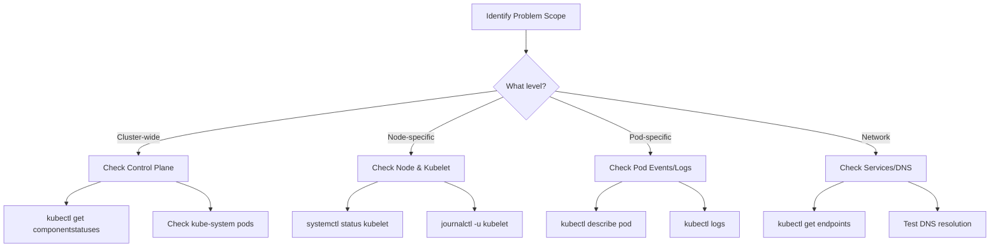
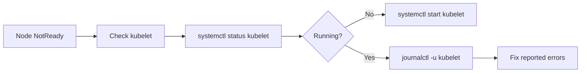
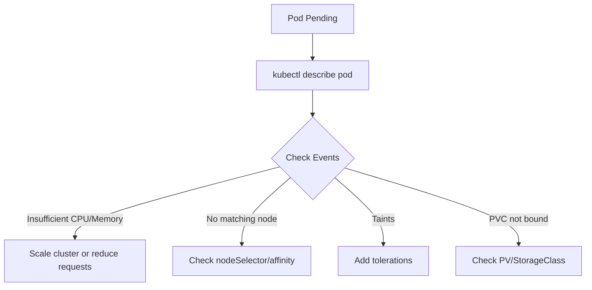

# Troubleshooting (30%)

The highest-weighted domain in the CKA exam. Master this section first.

## Competencies

- [ ] Troubleshoot clusters and nodes
- [ ] Troubleshoot cluster components
- [ ] Monitor cluster and application resource usage
- [ ] Manage and evaluate container output streams
- [ ] Troubleshoot services and networking

## Section Contents

```
01-troubleshooting/
├── README.md
├── cluster-and-nodes.md
├── control-plane-components.md
├── application-debugging.md
├── networking-troubleshooting.md
├── logs-and-monitoring.md
└── labs/
```

## Troubleshooting Workflow



## Key Commands

### Cluster & Node Health

```bash
# Node status
kubectl get nodes -o wide
kubectl describe node <node-name>

# Check kubelet (run on the node)
systemctl status kubelet
journalctl -u kubelet -f

# Control plane components (if using kubeadm)
kubectl get pods -n kube-system
```

### Pod Debugging

```bash
# Pod status and events
kubectl get pods -o wide
kubectl describe pod <pod-name>

# Container logs
kubectl logs <pod-name>
kubectl logs <pod-name> -c <container-name>    # Multi-container pods
kubectl logs <pod-name> --previous             # Previous container instance

# Execute into container
kubectl exec -it <pod-name> -- /bin/sh
```

### Service & Networking

```bash
# Service endpoints
kubectl get endpoints <service-name>
kubectl describe service <service-name>

# DNS troubleshooting
kubectl run test --image=busybox:1.28 --rm -it -- nslookup <service-name>

# Network connectivity
kubectl run test --image=busybox:1.28 --rm -it -- wget -qO- <service-ip>:<port>
```

## Common Issues & Solutions

### Node NotReady



```bash
# 1. Check kubelet status
systemctl status kubelet

# 2. Check kubelet logs
journalctl -u kubelet -f

# 3. Common fixes
systemctl restart kubelet
```

### Pod CrashLoopBackOff

```bash
# 1. Check logs
kubectl logs <pod-name> --previous

# 2. Check events
kubectl describe pod <pod-name>

# 3. Common causes:
#    - Application error
#    - Missing ConfigMap/Secret
#    - Resource limits too low
#    - Liveness probe failing
```

### Pod Pending



### Service Not Reachable

```bash
# 1. Verify endpoints exist
kubectl get endpoints <service-name>

# 2. Check selector matches pod labels
kubectl get pods --show-labels
kubectl describe service <service-name>

# 3. Test from within cluster
kubectl run test --image=busybox:1.28 --rm -it -- wget -qO- <cluster-ip>:<port>
```

## Control Plane Component Locations

| Component | Log Location |
|-----------|--------------|
| API Server | `/var/log/kube-apiserver.log` or `kubectl logs` |
| Scheduler | `/var/log/kube-scheduler.log` or `kubectl logs` |
| Controller Manager | `/var/log/kube-controller-manager.log` or `kubectl logs` |
| ETCD | `/var/log/etcd.log` or `kubectl logs` |
| Kubelet | `journalctl -u kubelet` |

## Practice Scenarios

1. A node shows NotReady - diagnose and fix
2. Pods are stuck in Pending state - identify the cause
3. Application is CrashLoopBackOff - debug and resolve
4. Service is not routing traffic to pods - troubleshoot connectivity
5. DNS resolution failing inside pods - fix CoreDNS issues
