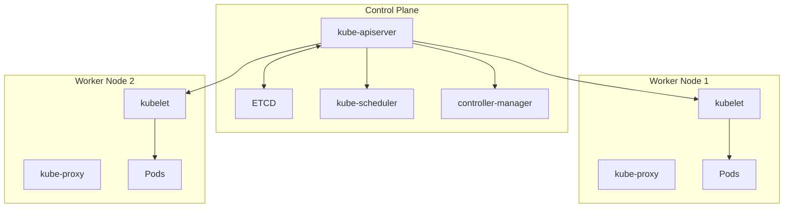
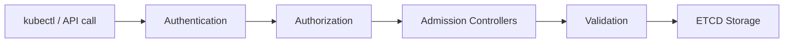
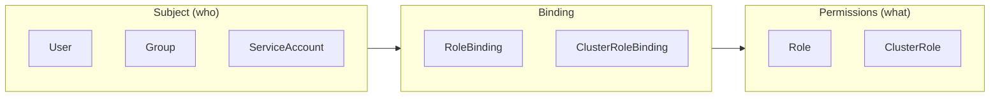
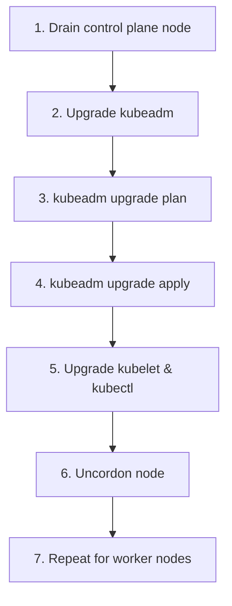

# Cluster Architecture, Installation & Configuration (25%)

This domain covers how Kubernetes clusters work internally and how to set them up.

## Competencies

- [ ] Manage role based access control (RBAC)
- [ ] Prepare underlying infrastructure for installing a Kubernetes cluster
- [ ] Create and manage Kubernetes clusters using kubeadm
- [ ] Manage the lifecycle of Kubernetes clusters
- [ ] Implement and configure a highly-available control plane
- [ ] Use Helm and Kustomize to install cluster components
- [ ] Understand extension interfaces (CNI, CSI, CRI, etc.)
- [ ] Understand CRDs, install and configure operators

## Section Contents

```
02-cluster-architecture/
├── README.md
├── control-plane-components/
│   ├── etcd.md
│   ├── kube-apiserver.md
│   ├── kube-controller-manager.md
│   ├── kube-scheduler.md
│   ├── kubelet.md
│   └── kube-proxy.md
├── rbac.md
├── kubeadm.md
├── cluster-upgrades.md
├── ha-control-plane.md
├── helm-kustomize.md
├── crds-operators.md
└── labs/
```
### Control Plane Components
* [etcd.md](etcd.md)

## Control Plane Architecture



## Component Summary

| Component | Role | Runs On |
|-----------|------|---------|
| **ETCD** | Key-value store for all cluster data | Control plane |
| **kube-apiserver** | Front door - all communication goes through it | Control plane |
| **kube-controller-manager** | Runs reconciliation loops | Control plane |
| **kube-scheduler** | Decides where pods run | Control plane |
| **kubelet** | Creates containers, reports status | All nodes |
| **kube-proxy** | Manages network rules for Services | All nodes |

## API Server Request Flow



## ETCD Backup & Restore

### Backup

```bash
ETCDCTL_API=3 etcdctl snapshot save /tmp/etcd-backup.db \
  --endpoints=https://127.0.0.1:2379 \
  --cacert=/etc/kubernetes/pki/etcd/ca.crt \
  --cert=/etc/kubernetes/pki/etcd/server.crt \
  --key=/etc/kubernetes/pki/etcd/server.key
```

### Verify

```bash
ETCDCTL_API=3 etcdctl snapshot status /tmp/etcd-backup.db --write-out=table
```

### Restore

```bash
# 1. Stop kube-apiserver (if static pod, move manifest out)
mv /etc/kubernetes/manifests/kube-apiserver.yaml /tmp/

# 2. Restore to new directory
ETCDCTL_API=3 etcdctl snapshot restore /tmp/etcd-backup.db \
  --data-dir=/var/lib/etcd-from-backup

# 3. Update etcd manifest to use new data-dir
vim /etc/kubernetes/manifests/etcd.yaml
# Change: --data-dir=/var/lib/etcd-from-backup
# Change: volumeMounts and volumes paths

# 4. Restore kube-apiserver manifest
mv /tmp/kube-apiserver.yaml /etc/kubernetes/manifests/
```

## RBAC

### Core Concepts



### Create Role

```yaml
apiVersion: rbac.authorization.k8s.io/v1
kind: Role
metadata:
  namespace: default
  name: pod-reader
rules:
- apiGroups: [""]
  resources: ["pods"]
  verbs: ["get", "watch", "list"]
```

### Create RoleBinding

```yaml
apiVersion: rbac.authorization.k8s.io/v1
kind: RoleBinding
metadata:
  name: read-pods
  namespace: default
subjects:
- kind: User
  name: jane
  apiGroup: rbac.authorization.k8s.io
roleRef:
  kind: Role
  name: pod-reader
  apiGroup: rbac.authorization.k8s.io
```

### Quick Commands

```bash
# Check permissions
kubectl auth can-i create pods --as jane
kubectl auth can-i create pods --as jane --namespace dev

# Create role imperatively
kubectl create role pod-reader --verb=get,list,watch --resource=pods

# Create rolebinding imperatively
kubectl create rolebinding read-pods --role=pod-reader --user=jane
```

## Kubeadm Cluster Operations

### Cluster Upgrade Process



```bash
# 1. Upgrade control plane node
kubectl drain <control-plane-node> --ignore-daemonsets

# 2. Upgrade kubeadm
apt-get update
apt-get install -y kubeadm=1.31.0-00

# 3. Plan and apply
kubeadm upgrade plan
kubeadm upgrade apply v1.31.0

# 4. Upgrade kubelet and kubectl
apt-get install -y kubelet=1.31.0-00 kubectl=1.31.0-00
systemctl daemon-reload
systemctl restart kubelet

# 5. Uncordon
kubectl uncordon <control-plane-node>

# 6. Repeat for worker nodes (use kubeadm upgrade node instead of apply)
```

## File Locations Reference

| File | Purpose |
|------|---------|
| `/etc/kubernetes/manifests/` | Static pod manifests |
| `/etc/kubernetes/pki/` | Cluster certificates |
| `/var/lib/etcd/` | ETCD data directory |
| `/var/lib/kubelet/config.yaml` | Kubelet configuration |
| `~/.kube/config` | kubectl configuration |

## Practice Scenarios

1. Backup and restore ETCD
2. Create RBAC rules for a new user
3. Upgrade a cluster from 1.30 to 1.31
4. Install an application using Helm
5. Configure a highly-available control plane

---

[Back to root folder](../README.md)