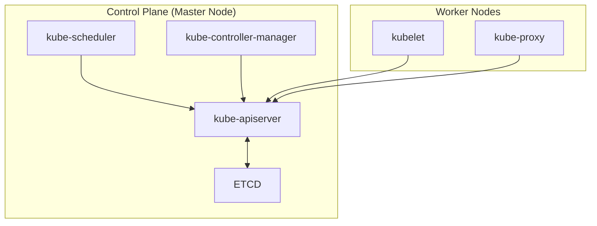
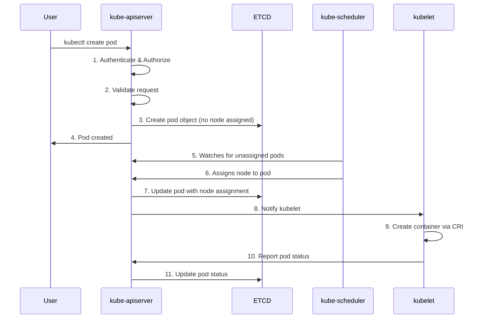
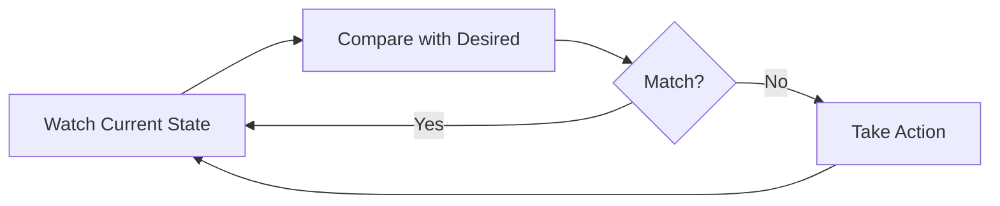
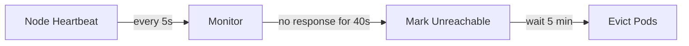
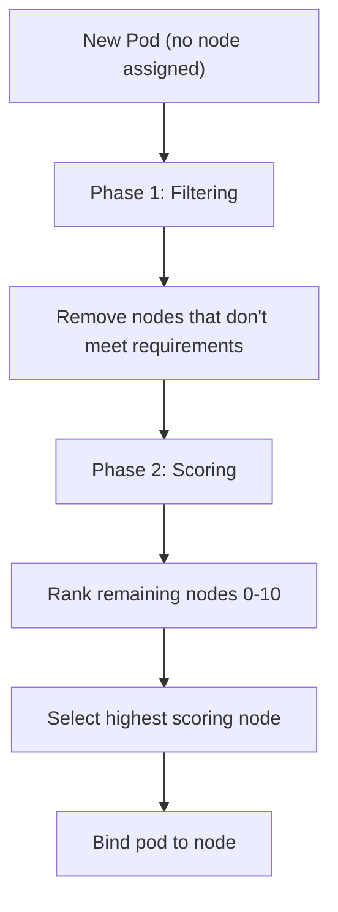
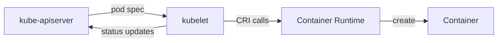
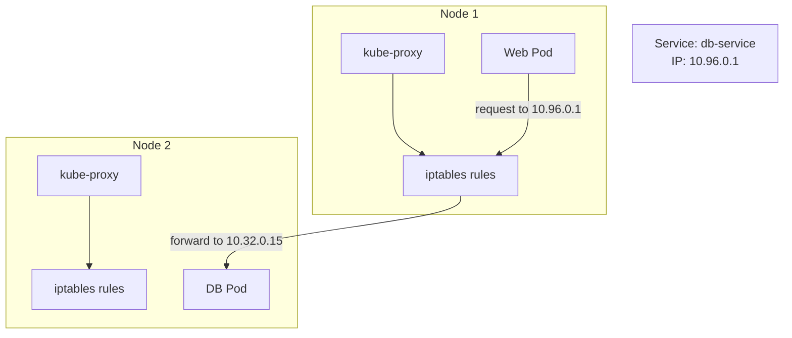

# Control Plane Components

The control plane is responsible for managing the cluster state, making scheduling decisions, and responding to cluster events. This document covers the core components and their interactions.

## Component Overview



| Component | Location | Role |
|-----------|----------|------|
| kube-apiserver | Control Plane | Front door, only component that talks to ETCD |
| kube-controller-manager | Control Plane | Runs reconciliation loops |
| kube-scheduler | Control Plane | Decides where pods run |
| kubelet | Every Node | Creates pods, reports status |
| kube-proxy | Every Node | Manages network rules for Services |

---

## Kube-API Server

The kube-apiserver is the **primary management component** and the central hub for all cluster operations.

### Responsibilities - Kube-API Server

1. **Authentication** - Validates who you are
2. **Authorization** - Checks what you can do
3. **Validation** - Ensures request is valid
4. **Data persistence** - Updates ETCD
5. **Communication hub** - Other components interact through it

> 💡 **Key Point:** The kube-apiserver is the **only component** that interacts directly with ETCD.

### Pod Creation Flow



### Configuration

**Key option to remember:**

```bash
--etcd-servers=https://127.0.0.1:2379  # How API server connects to ETCD
```

### View API Server Options

| Setup Method | Location |
|--------------|----------|
| kubeadm | `/etc/kubernetes/manifests/kube-apiserver.yaml` |
| Manual | `/etc/systemd/system/kube-apiserver.service` |
| Running process | `ps aux \| grep kube-apiserver` |

### Direct API Access

You can bypass kubectl and call the API directly:

```bash
# Example: Create a pod via API
curl -X POST https://<api-server>:6443/api/v1/namespaces/default/pods \
  --header "Authorization: Bearer $TOKEN" \
  --header "Content-Type: application/json" \
  -d @pod.json
```

---

## Kube-Controller-Manager

The kube-controller-manager runs **controller processes** that regulate cluster state. Each controller is a reconciliation loop that watches the current state and works to achieve the desired state.

### What is a Controller?

A controller continuously:

1. **Monitors** the state of specific resources
2. **Compares** current state vs desired state
3. **Takes action** to reconcile differences



### Key Controllers

| Controller | Responsibility |
|------------|----------------|
| **Node Controller** | Monitors node health, handles node failures |
| **Replication Controller** | Ensures correct number of pod replicas |
| **Deployment Controller** | Manages ReplicaSets for Deployments |
| **Endpoints Controller** | Populates Endpoints objects |
| **Service Account Controller** | Creates default ServiceAccounts |
| **Job Controller** | Watches Jobs, creates Pods |

### Node Controller Timing



| Parameter | Default Value | Description |
|-----------|---------------|-------------|
| `--node-monitor-period` | 5s | How often to check node status |
| `--node-monitor-grace-period` | 40s | Time before marking node unreachable |
| `--pod-eviction-timeout` | 5m | Time before evicting pods from unhealthy node |

### View Controller Manager Options

| Setup Method | Location |
|--------------|----------|
| kubeadm | `/etc/kubernetes/manifests/kube-controller-manager.yaml` |
| Manual | `/etc/systemd/system/kube-controller-manager.service` |
| Running process | `ps aux \| grep kube-controller-manager` |

> 📝 **Note:** All controllers are packaged into a single binary. Use the `--controllers` flag to enable/disable specific controllers.

---

## Kube-Scheduler

The kube-scheduler is responsible for **deciding which node** a pod should run on. It does **not** actually create the pod—that's the kubelet's job.

### Scheduling Process



### Phase 1: Filtering

Eliminates nodes that cannot run the pod:

- Insufficient CPU/Memory
- Node selector doesn't match
- Taints not tolerated
- Affinity rules not satisfied

### Phase 2: Scoring

Ranks remaining nodes based on:

- Available resources after scheduling
- Spreading pods across nodes
- Affinity preferences
- Custom priorities

**Example:** If a pod needs 4 CPU, and two nodes qualify:

- Node A: Would have 2 CPU free after → Score: Lower
- Node B: Would have 6 CPU free after → Score: Higher ✓

### View Scheduler Options

| Setup Method | Location |
|--------------|----------|
| kubeadm | `/etc/kubernetes/manifests/kube-scheduler.yaml` |
| Manual | `/etc/systemd/system/kube-scheduler.service` |
| Running process | `ps aux \| grep kube-scheduler` |

> 📝 **Note:** Scheduling topics like taints/tolerations, node selectors, and affinity are covered in detail in the Workloads & Scheduling section.

---

## Kubelet

The kubelet is the **agent that runs on every node** (including control plane nodes in some setups). It's responsible for actually running pods.

### Responsibilities - Kubelet

1. **Register node** with the cluster via API server
2. **Watch API server** for pod assignments to this node
3. **Request container runtime** (Docker, containerd) to pull images and run containers
4. **Monitor pods** and containers continuously
5. **Report status** back to API server



### Key Difference from Other Components

> ⚠️ **Important:** Unlike other components, kubeadm does **NOT** automatically deploy kubelet. You must manually install it on every node.

### Installation

```bash
# Download kubelet binary
wget https://dl.k8s.io/release/v1.31.0/bin/linux/amd64/kubelet

# Run as a service
systemctl status kubelet
```

### View Kubelet Options

```bash
# View running process
ps aux | grep kubelet

# View kubelet configuration
cat /var/lib/kubelet/config.yaml

# Check kubelet status
systemctl status kubelet

# View kubelet logs
journalctl -u kubelet -f
```

---

## Kube-Proxy

Kube-proxy is a **network proxy** that runs on each node, implementing the Kubernetes Service concept.

### The Problem

- Pods have dynamic IPs that change when pods restart
- Services provide stable IPs/names to access pods
- But Services are **virtual**—they don't have actual processes or network interfaces

### The Solution: kube-proxy



### How It Works

1. kube-proxy watches the API server for new Services
2. When a Service is created, kube-proxy creates **iptables rules** on each node
3. Rules forward traffic destined for Service IP → actual Pod IP

**Example iptables rule:**

```plain-text
Traffic to 10.96.0.1 (Service) → Forward to 10.32.0.15 (Pod)
```

### Proxy Modes

| Mode | Description |
|------|-------------|
| **iptables** | Default, uses Linux iptables rules |
| **IPVS** | Better performance for large clusters |
| **userspace** | Legacy, rarely used |

### Deployment

kube-proxy is deployed as a **DaemonSet**, ensuring one pod runs on every node:

```bash
kubectl get daemonset kube-proxy -n kube-system
```

> 📝 **Note:** Networking concepts including Services, kube-proxy modes, and pod networking are covered in detail in the Services & Networking section.

---

## Component Locations Summary

### kubeadm Setup

All control plane components run as **static pods** with manifests in:

```plain-text
/etc/kubernetes/manifests/
├── etcd.yaml
├── kube-apiserver.yaml
├── kube-controller-manager.yaml
└── kube-scheduler.yaml
```

### Manual Setup

Components run as **systemd services**:

```plain-text
/etc/systemd/system/
├── kube-apiserver.service
├── kube-controller-manager.service
├── kube-scheduler.service
└── kubelet.service
```

### Quick Inspection Commands

```bash
# View control plane pods (kubeadm)
kubectl get pods -n kube-system

# View component status
kubectl get componentstatuses  # deprecated but still works

# Check specific component
ps aux | grep kube-apiserver
ps aux | grep kube-controller-manager
ps aux | grep kube-scheduler
ps aux | grep kubelet
```

---

## Key Takeaways

1. **kube-apiserver** is the only component that talks to ETCD
2. **kube-controller-manager** contains all the "brains" (reconciliation loops)
3. **kube-scheduler** only **decides** where pods go, doesn't create them
4. **kubelet** must be installed manually, even with kubeadm
5. **kube-proxy** implements Services using iptables/IPVS rules
6. Changes flow: `kubectl` → API Server → ETCD → Scheduler → kubelet