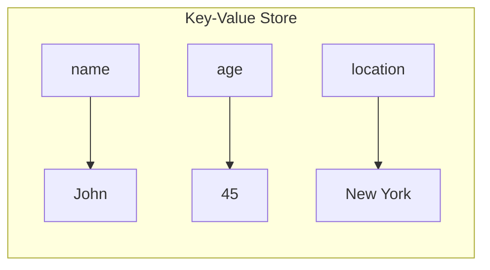
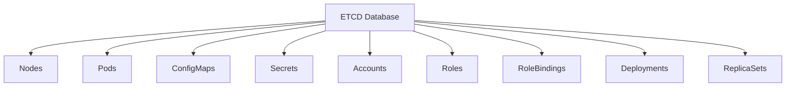

# ETCD

ETCD is a distributed, reliable key-value store that is simple, secure, and fast. It serves as Kubernetes' backing store for all cluster data.

## What is a Key-Value Store?

Understanding the difference between storage models helps clarify why Kubernetes uses ETCD.



| Storage Type | Schema | Complex Queries | Flexibility | Best For |
|--------------|--------|-----------------|-------------|----------|
| **Relational (SQL)** | Strict | Yes (SQL joins) | Rigid | Structured data |
| **Document Store** | None | Limited | Flexible | Semi-structured data |
| **Key-Value Store** | None | No | Very flexible | Simple, fast lookups |

Key-value stores are ideal for Kubernetes because:
- Fast read/write operations
- Simple data model (key → value)
- Values can be simple strings or complex JSON documents
- No schema constraints

## ETCD in Kubernetes

### What ETCD Stores

Every piece of cluster information is stored in ETCD:



**Key concept:** When you run `kubectl get` commands, all data comes from ETCD. A change is only considered complete once it's updated in ETCD.

### Directory Structure

Kubernetes stores data in ETCD with a specific structure:

```
/registry
├── /minions (nodes)
├── /pods
├── /replicasets
├── /deployments
├── /secrets
├── /configmaps
└── ...
```

## ETCD Configuration

### Default Port

| Port | Purpose |
|------|---------|
| **2379** | Client communication (API Server → ETCD) |
| **2380** | Peer communication (ETCD cluster members) |

### Deployment Methods

#### Method 1: Manual Setup (From Scratch)

Download binaries and configure as a system service:

```bash
# Download and extract
wget https://github.com/etcd-io/etcd/releases/download/v3.5.x/etcd-v3.5.x-linux-amd64.tar.gz
tar xvf etcd-v3.5.x-linux-amd64.tar.gz

# Run etcd (simplest form)
./etcd
```

Key service configuration options:
- `--advertise-client-urls`: Address where ETCD listens (configured in kube-apiserver)
- `--initial-cluster`: Required for HA setups to specify all ETCD instances
- Certificate options for TLS (covered in security section)

#### Method 2: kubeadm Setup

kubeadm deploys ETCD as a static pod in `kube-system` namespace:

```bash
# View ETCD pod
kubectl get pods -n kube-system | grep etcd

# ETCD manifest location
/etc/kubernetes/manifests/etcd.yaml
```

## ETCDCTL CLI Tool

ETCDCTL is the command-line client for interacting with ETCD.

### API Versions

> ⚠️ **Important:** ETCDCTL has two API versions with different commands.

| API Version | Set Command | Get Command | Delete Command |
|-------------|-------------|-------------|----------------|
| v2 (default) | `etcdctl set` | `etcdctl get` | `etcdctl rm` |
| v3 | `etcdctl put` | `etcdctl get` | `etcdctl delete` |

**Always set API version explicitly:**

```bash
export ETCDCTL_API=3
```

### Basic Commands (API v3)

```bash
# Store a key-value pair
etcdctl put key1 value1

# Retrieve a value
etcdctl get key1

# Delete a key
etcdctl delete key1

# List all keys
etcdctl get / --prefix --keys-only
```

### Authentication with Certificates

ETCD requires TLS certificates for authentication. Certificate locations in kubeadm setup:

```
/etc/kubernetes/pki/etcd/
├── ca.crt          # CA certificate
├── server.crt      # Server certificate
└── server.key      # Server private key
```

### Complete Command Example

```bash
# List all keys in ETCD (running inside etcd pod)
kubectl exec etcd-master -n kube-system -- sh -c \
  "ETCDCTL_API=3 etcdctl get / --prefix --keys-only --limit=10 \
  --cacert /etc/kubernetes/pki/etcd/ca.crt \
  --cert /etc/kubernetes/pki/etcd/server.crt \
  --key /etc/kubernetes/pki/etcd/server.key"
```

### Check ETCD Version

```bash
etcdctl version

# Output shows:
# etcdctl version: 3.5.x
# API version: 3.5
```

## ETCD Version History

| Date | Version | Significance |
|------|---------|--------------|
| Aug 2013 | 0.1 | First release |
| Feb 2015 | 2.0 | Stable release, Raft consensus redesign |
| Jan 2017 | 3.0 | Major API changes, performance improvements |
| Nov 2018 | - | Became CNCF incubator project |
| Nov 2020 | - | Became CNCF graduated project |
| Jun 2021 | 3.5 | Latest major release |

## High Availability

In HA setups:

- Multiple master nodes each run an ETCD instance
- ETCD instances must know about each other
- Configure using `--initial-cluster` option

```bash
--initial-cluster etcd1=https://10.0.0.1:2380,etcd2=https://10.0.0.2:2380,etcd3=https://10.0.0.3:2380
```

> 📝 **Note:** HA configuration is covered in detail in the High Availability section of the course.

## Key Takeaways

1. **ETCD is the single source of truth** for all cluster state
2. **Port 2379** for client connections (memorize this)
3. **Always use `ETCDCTL_API=3`** for modern commands
4. **Certificates are required** for authentication
5. **Backup ETCD regularly** - losing ETCD means losing cluster state
6. Changes are only complete when written to ETCD

---

[Back to 02-cluster-architecture](README.md)

[Back to root folder](../README.md)