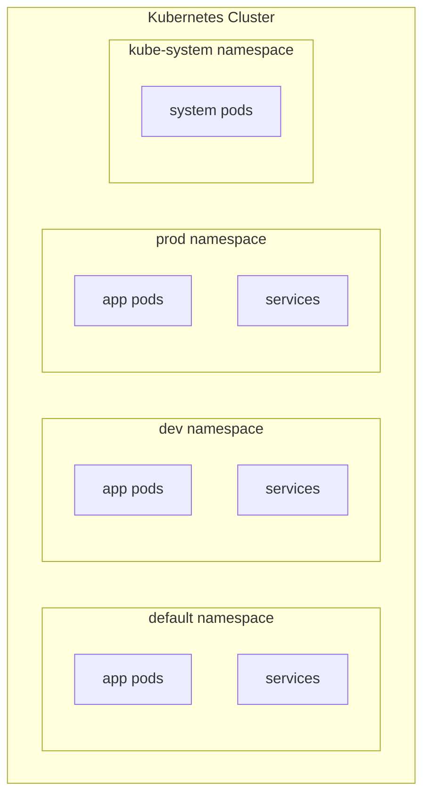

# Namespaces

Namespaces provide a mechanism for isolating groups of resources within a single Kubernetes cluster. They are like virtual clusters inside your physical cluster.

## Why Namespaces?



**Use cases:**

- Isolate environments (dev, staging, prod)
- Separate teams or projects
- Apply resource quotas per namespace
- Define access control policies (RBAC)

---

## Default Namespaces

Kubernetes creates these namespaces automatically:

| Namespace | Purpose |
|-----------|---------|
| **default** | Where your resources go if no namespace is specified |
| **kube-system** | System components (DNS, networking, etc.) |
| **kube-public** | Resources accessible to all users |
| **kube-node-lease** | Node heartbeat data |

> ⚠️ Don't modify or delete resources in `kube-system`—it contains critical cluster components.

---

## DNS and Service Discovery

### Same Namespace

Resources within the same namespace can refer to each other by name:

```mermaid
flowchart LR
    subgraph default["default namespace"]
        WEB["web-pod"] -->|"db-service"| DB["db-service"]
    end
```

```bash
# From web-pod
curl http://db-service:3306
```

### Cross-Namespace

To reach a service in another namespace, use the fully qualified domain name (FQDN):

```mermaid
flowchart LR
    subgraph default["default namespace"]
        WEB["web-pod"]
    end
    
    subgraph dev["dev namespace"]
        DB["db-service"]
    end
    
    WEB -->|"db-service.dev.svc.cluster.local"| DB
```

```bash
# From web-pod in default namespace to db-service in dev namespace
curl http://db-service.dev.svc.cluster.local:3306
```

### DNS Format

```plain-text
<service-name>.<namespace>.svc.cluster.local
       │            │       │       │
       │            │       │       └── Cluster domain
       │            │       └── Subdomain for services
       │            └── Namespace name
       └── Service name
```

---

## Working with Namespaces

### View Resources in a Namespace

```bash
# List pods in default namespace
kubectl get pods

# List pods in a specific namespace
kubectl get pods -n kube-system
kubectl get pods --namespace=dev

# List pods in ALL namespaces
kubectl get pods --all-namespaces
kubectl get pods -A              # short form
```

### Create Resources in a Namespace

```bash
# Imperative - specify namespace in command
kubectl create -f pod.yaml -n dev
kubectl run nginx --image=nginx -n dev

# Declarative - specify namespace in YAML
```

```yaml
apiVersion: v1
kind: Pod
metadata:
  name: myapp-pod
  namespace: dev          # Specify namespace here
  labels:
    app: myapp
spec:
  containers:
  - name: nginx
    image: nginx
```

> 💡 **Best Practice:** Define the namespace in the YAML file to ensure resources are always created in the correct namespace.

---

## Creating Namespaces

### Method 1: YAML Definition

```yaml
apiVersion: v1
kind: Namespace
metadata:
  name: dev
```

```bash
kubectl create -f namespace.yaml
```

### Method 2: Imperative Command

```bash
kubectl create namespace dev
kubectl create ns dev          # short form
```

---

## Switching Default Namespace

By default, `kubectl` commands operate in the `default` namespace. You can change this:

```bash
# Set default namespace for current context
kubectl config set-context --current --namespace=dev

# Now all commands use 'dev' namespace by default
kubectl get pods              # Shows pods in dev namespace

# To access other namespaces, use -n flag
kubectl get pods -n default
kubectl get pods -n prod
```

### View Current Context

```bash
# See current context and namespace
kubectl config get-contexts

# View current namespace
kubectl config view --minify | grep namespace
```

---

## Resource Quotas

Limit resources that a namespace can consume:

```yaml
apiVersion: v1
kind: ResourceQuota
metadata:
  name: dev-quota
  namespace: dev
spec:
  hard:
    pods: "10"
    requests.cpu: "4"
    requests.memory: 4Gi
    limits.cpu: "8"
    limits.memory: 8Gi
```

```bash
# Create the quota
kubectl create -f quota.yaml

# View quotas
kubectl get resourcequota -n dev
kubectl describe resourcequota dev-quota -n dev
```

---

## Essential Commands

| Command | Description |
|---------|-------------|
| `kubectl get ns` | List all namespaces |
| `kubectl create ns <n>` | Create namespace |
| `kubectl delete ns <n>` | Delete namespace (and all resources in it!) |
| `kubectl get pods -n <n>` | List pods in namespace |
| `kubectl get pods -A` | List pods in all namespaces |
| `kubectl config set-context --current --namespace=<n>` | Switch default namespace |

---

## Quick Reference

### Namespace in Commands

```bash
# Short form
kubectl get pods -n dev

# Long form
kubectl get pods --namespace=dev

# All namespaces
kubectl get pods -A
kubectl get pods --all-namespaces
```

### Namespace in YAML

```yaml
metadata:
  name: myapp-pod
  namespace: dev      # Add this line
```

---

## Key Takeaways

1. **Namespaces isolate resources** within a cluster
2. **Don't touch `kube-system`**—it contains critical components
3. **Same namespace:** access services by name (`db-service`)
4. **Cross-namespace:** use FQDN (`db-service.dev.svc.cluster.local`)
5. **Use `-n` flag** or set default namespace with `kubectl config`
6. **`-A` or `--all-namespaces`** to see resources across all namespaces
7. **Resource quotas** limit what a namespace can consume
8. **Deleting a namespace deletes everything in it**—be careful!

---

[Back to 02-cluster-architecture](README.md)

[Back to root folder](../README.md)
