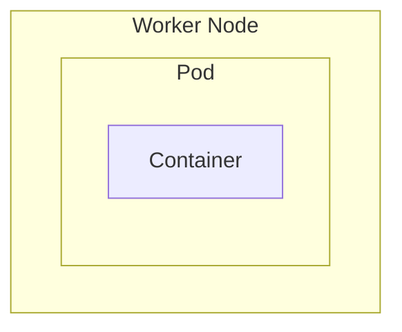
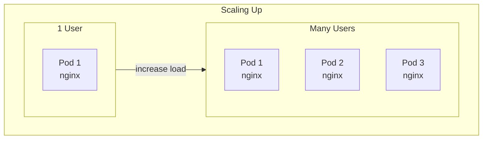
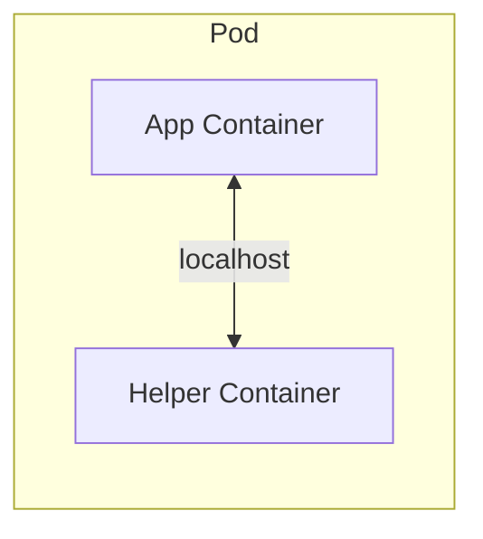
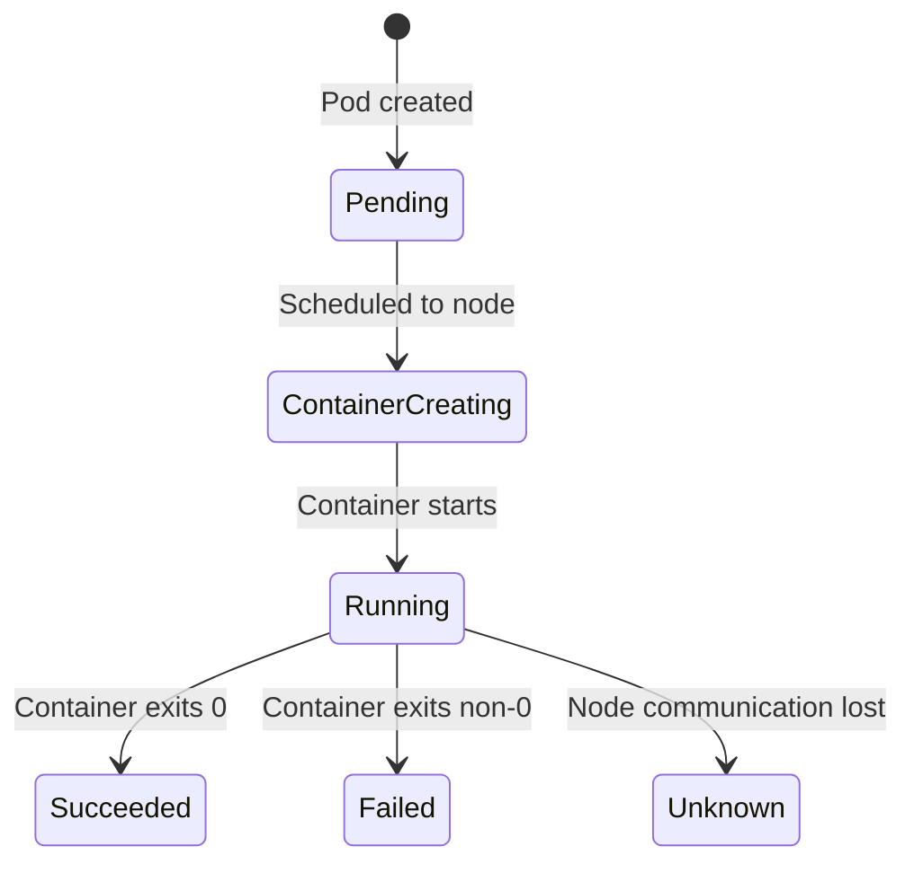

# Pods

A Pod is the smallest deployable unit in Kubernetes. It represents a single instance of a running process in your cluster.

## What is a Pod?



**Key concepts:**

- A Pod is a **single instance** of an application
- Containers are **encapsulated** inside Pods
- Kubernetes never deploys containers directly—always through Pods
- Pods are the smallest object you can create in Kubernetes

## Scaling with Pods

> ⚠️ **Important:** To scale your application, you create **new Pods**, not additional containers inside an existing Pod.



| Action | Correct Approach | Wrong Approach |
|--------|------------------|----------------|
| Scale up | Create new Pod | Add container to existing Pod |
| Scale down | Delete Pod | - |

## Pod to Container Relationship

Pods usually have a **1:1 relationship** with application containers, but can have multiple containers in specific cases.

### Single Container Pod (Most Common)

```yaml
spec:
  containers:
  - name: nginx
    image: nginx
```

### Multi-Container Pod (Rare)

Used for **helper/sidecar containers** that:

- Support the main application
- Must share the same lifecycle
- Need to communicate via localhost
- Need to share storage



**What Kubernetes handles automatically for multi-container Pods:**

- Shared network namespace (localhost communication)
- Shared storage volumes
- Same lifecycle (created and destroyed together)

---

## Pod Definition YAML

Every Kubernetes object follows the same structure with **four required top-level fields**:

```yaml
apiVersion:    # API version
kind:          # Type of object
metadata:      # Object metadata (name, labels)
spec:          # Object specification
```

### Complete Pod Example

```yaml
apiVersion: v1
kind: Pod
metadata:
  name: myapp-pod
  labels:
    app: myapp
    tier: frontend
spec:
  containers:
  - name: nginx-container
    image: nginx
```

### Field Breakdown

| Field | Type | Description |
|-------|------|-------------|
| `apiVersion` | String | API version (`v1` for Pods) |
| `kind` | String | Object type (`Pod`) |
| `metadata` | Dictionary | Name, labels, annotations |
| `spec` | Dictionary | Container specifications |

### API Versions Reference

| Kind | apiVersion |
|------|------------|
| Pod | `v1` |
| Service | `v1` |
| ReplicaSet | `apps/v1` |
| Deployment | `apps/v1` |

---

## YAML Best Practices

### Indentation Rules

```yaml
# ✓ CORRECT - consistent 2-space indentation
metadata:
  name: myapp-pod
  labels:
    app: myapp
    tier: frontend

# ✗ WRONG - inconsistent indentation
metadata:
  name: myapp-pod
   labels:          # wrong: 3 spaces
    app: myapp
```

**Rules:**

- Use **2 spaces** for indentation (never tabs)
- Be consistent throughout the file
- Children must be indented more than parents
- Siblings must have the same indentation

### Structure Visualization

```plain-text
metadata:           # Parent (0 spaces)
  name: myapp       # Child of metadata (2 spaces)
  labels:           # Sibling of name (2 spaces)
    app: myapp      # Child of labels (4 spaces)
    tier: frontend  # Sibling of app (4 spaces)
```

### Lists vs Dictionaries

```yaml
# Dictionary (key: value)
metadata:
  name: myapp-pod

# List (starts with -)
containers:
- name: nginx        # First item
  image: nginx
- name: busybox      # Second item
  image: busybox
```

### Common Mistakes to Avoid

```yaml
# ✗ WRONG - using tabs
metadata:
	name: myapp    # This is a tab, not spaces

# ✗ WRONG - incorrect sibling indentation
metadata:
  name: myapp
    labels:        # Should be same level as name
      app: myapp

# ✗ WRONG - missing dash for list item
containers:
  name: nginx      # Should be "- name: nginx"
  image: nginx

# ✓ CORRECT
containers:
- name: nginx
  image: nginx
```

### Editor Tips

| Editor | Recommendation |
|--------|----------------|
| **vim** | Add to `.vimrc`: `set expandtab tabstop=2 shiftwidth=2` |
| **VS Code** | Install YAML extension, enable format on save |
| **Any editor** | Use YAML language support for syntax highlighting |

---

## Essential Commands

### Create Pod

```bash
# From YAML file
kubectl create -f pod.yaml
kubectl apply -f pod.yaml    # Same for new objects

# Imperative (quick)
kubectl run nginx --image=nginx
```

### View Pods

```bash
# List all pods
kubectl get pods

# More details (IP, Node)
kubectl get pods -o wide

# Detailed information
kubectl describe pod myapp-pod
```

### Generate YAML Template

```bash
# Generate YAML without creating the pod
kubectl run nginx --image=nginx --dry-run=client -o yaml > pod.yaml
```

This is extremely useful for:

- Getting the correct structure
- Avoiding typos
- Quick exam answers

---

## Pod Lifecycle



| Status | Meaning |
|--------|---------|
| `Pending` | Accepted but not running (scheduling, image pull) |
| `ContainerCreating` | Image being pulled, container starting |
| `Running` | At least one container running |
| `Succeeded` | All containers terminated successfully |
| `Failed` | At least one container failed |
| `Unknown` | State cannot be determined |

---

## Key Takeaways

1. **Pods encapsulate containers** - Kubernetes never runs containers directly
2. **Scale by adding Pods**, not containers inside Pods
3. **Multi-container Pods** are for tightly coupled helper containers (sidecar pattern)
4. **Four required fields**: `apiVersion`, `kind`, `metadata`, `spec`
5. **Use 2-space indentation**, never tabs
6. **Use `--dry-run=client -o yaml`** to generate templates quickly
7. Pods share network and storage by default between their containers

---

[Back to 02-cluster-architecture](README.md)

[Back to root folder](../README.md)
