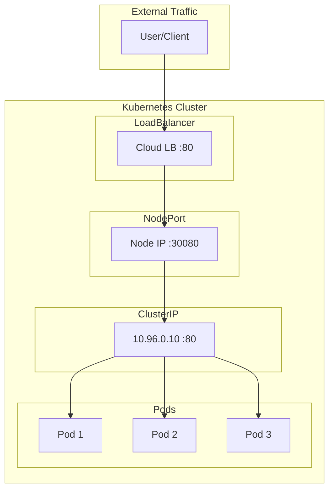
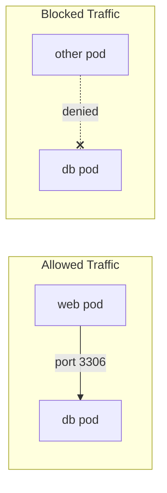
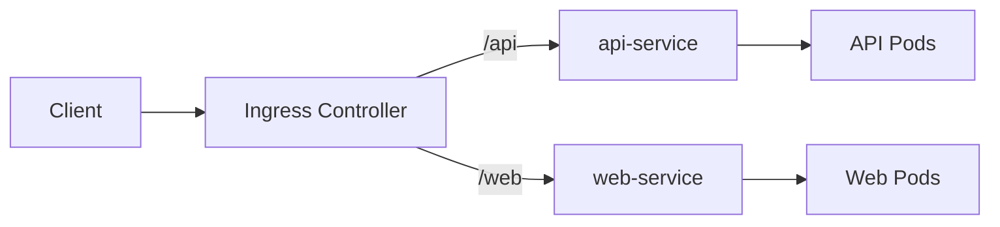

# Services & Networking (20%)

Understanding how pods communicate with each other and the outside world.

## Competencies

- [ ] Understand connectivity between Pods
- [ ] Define and enforce Network Policies
- [ ] Use ClusterIP, NodePort, LoadBalancer service types and endpoints
- [ ] Use the Gateway API to manage Ingress traffic
- [ ] Know how to use Ingress controllers and Ingress resources
- [ ] Understand and use CoreDNS

## Section Contents

```
03-services-networking/
├── README.md
├── pod-networking.md
├── services.md
├── network-policies.md
├── ingress.md
├── gateway-api.md
├── coredns.md
└── labs/
```

## Service Types Overview



| Type | Use Case | Accessible From |
|------|----------|-----------------|
| **ClusterIP** | Internal communication | Within cluster only |
| **NodePort** | External access via node ports | Outside cluster via `<NodeIP>:<NodePort>` |
| **LoadBalancer** | Cloud load balancer | External (cloud providers) |
| **ExternalName** | DNS alias | Maps to external DNS name |

### ClusterIP (Default)

```yaml
apiVersion: v1
kind: Service
metadata:
  name: my-service
spec:
  type: ClusterIP
  selector:
    app: my-app
  ports:
  - port: 80
    targetPort: 8080
```

### NodePort

```yaml
apiVersion: v1
kind: Service
metadata:
  name: my-service
spec:
  type: NodePort
  selector:
    app: my-app
  ports:
  - port: 80
    targetPort: 8080
    nodePort: 30080    # Range: 30000-32767
```

### Quick Commands

```bash
# Create service imperatively
kubectl expose pod nginx --port=80 --target-port=80 --type=ClusterIP
kubectl expose deployment nginx --port=80 --type=NodePort

# Check endpoints
kubectl get endpoints <service-name>
```

## Network Policies

Network Policies control traffic flow between pods.



### Default: Allow All

By default, all pods can communicate with all other pods.

### Deny All Ingress

```yaml
apiVersion: networking.k8s.io/v1
kind: NetworkPolicy
metadata:
  name: deny-all
  namespace: default
spec:
  podSelector: {}    # Applies to all pods
  policyTypes:
  - Ingress
```

### Allow Specific Ingress

```yaml
apiVersion: networking.k8s.io/v1
kind: NetworkPolicy
metadata:
  name: allow-nginx
spec:
  podSelector:
    matchLabels:
      app: db
  policyTypes:
  - Ingress
  ingress:
  - from:
    - podSelector:
        matchLabels:
          app: web
    ports:
    - protocol: TCP
      port: 3306
```

### Allow from Namespace

```yaml
apiVersion: networking.k8s.io/v1
kind: NetworkPolicy
metadata:
  name: allow-from-namespace
spec:
  podSelector:
    matchLabels:
      app: db
  ingress:
  - from:
    - namespaceSelector:
        matchLabels:
          name: production
```

## Ingress

Ingress exposes HTTP/HTTPS routes to services.



### Basic Ingress

```yaml
apiVersion: networking.k8s.io/v1
kind: Ingress
metadata:
  name: my-ingress
spec:
  rules:
  - host: myapp.example.com
    http:
      paths:
      - path: /
        pathType: Prefix
        backend:
          service:
            name: my-service
            port:
              number: 80
```

### Path-Based Routing

```yaml
apiVersion: networking.k8s.io/v1
kind: Ingress
metadata:
  name: path-ingress
spec:
  rules:
  - host: myapp.example.com
    http:
      paths:
      - path: /api
        pathType: Prefix
        backend:
          service:
            name: api-service
            port:
              number: 80
      - path: /web
        pathType: Prefix
        backend:
          service:
            name: web-service
            port:
              number: 80
```

## CoreDNS

CoreDNS provides DNS resolution within the cluster.

### DNS Names

| Resource | DNS Name |
|----------|----------|
| Service | `<service>.<namespace>.svc.cluster.local` |
| Pod | `<pod-ip-dashed>.<namespace>.pod.cluster.local` |

### Testing DNS

```bash
# Create a test pod
kubectl run test --image=busybox:1.28 --rm -it -- nslookup kubernetes

# Test service resolution
kubectl run test --image=busybox:1.28 --rm -it -- nslookup my-service.default.svc.cluster.local
```

### CoreDNS ConfigMap

```bash
kubectl get configmap coredns -n kube-system -o yaml
```

## Practice Scenarios

1. Create a ClusterIP service and verify connectivity
2. Expose an application externally using NodePort
3. Create a NetworkPolicy to isolate a database pod
4. Configure Ingress with path-based routing
5. Troubleshoot DNS resolution issues
