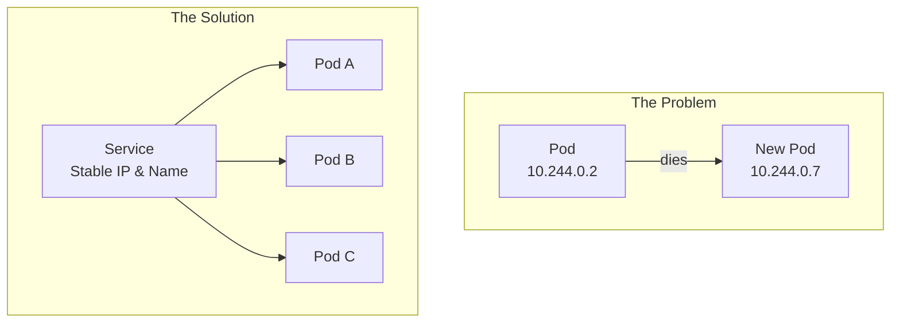
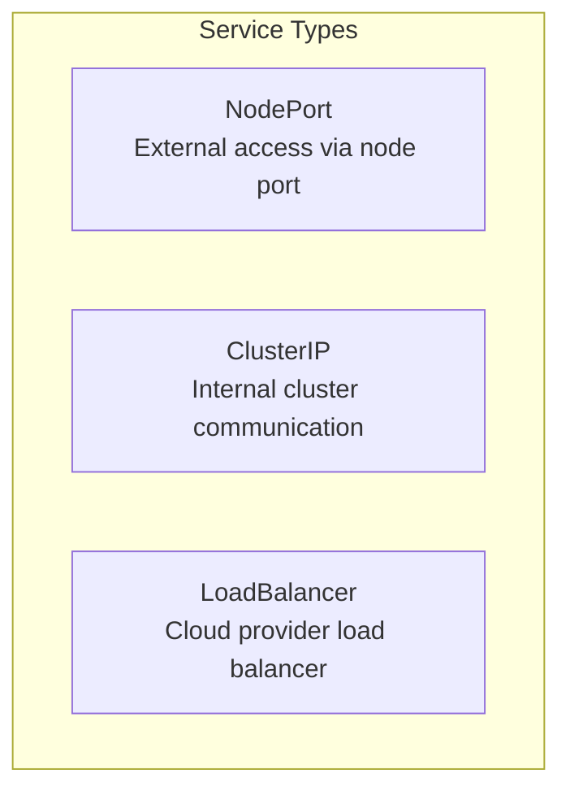
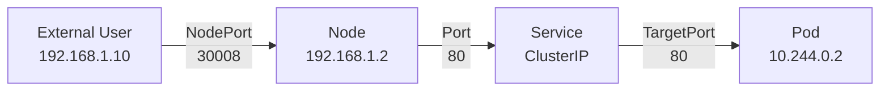
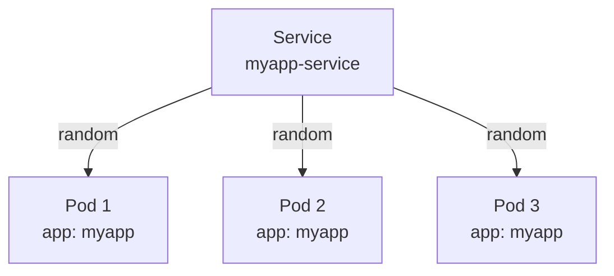
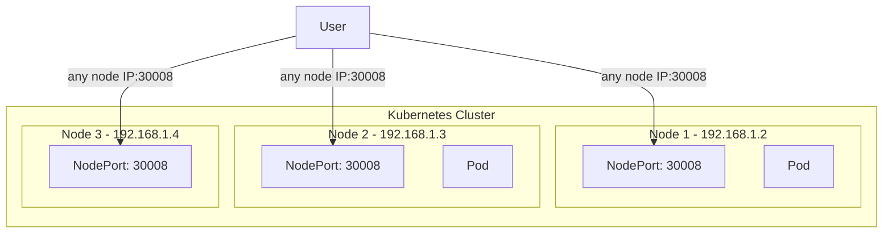
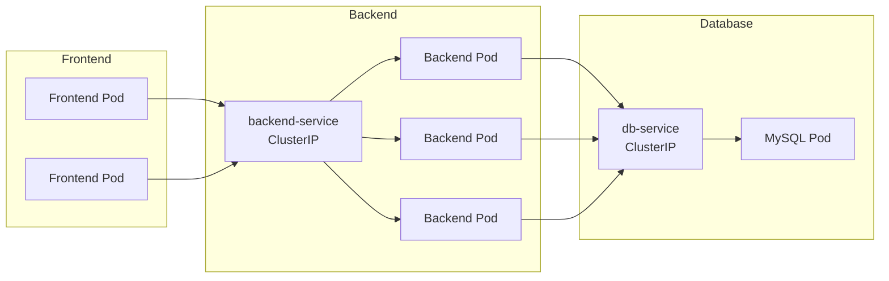
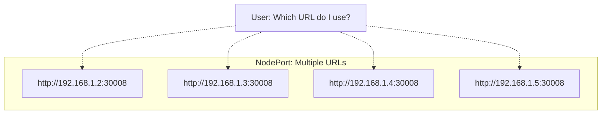
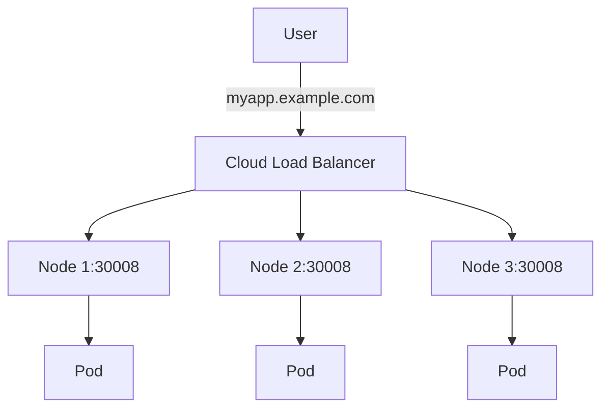

# Services

Services enable communication between components within and outside of a Kubernetes cluster. They provide stable networking endpoints for accessing pods.

## Why Services?

Pods are ephemeral—they can be created, destroyed, and rescheduled at any time. Each pod gets a new IP address, making direct pod-to-pod communication unreliable.



**Services provide:**

- Stable IP address and DNS name
- Load balancing across pods
- Service discovery
- Loose coupling between microservices

---

## Service Types



| Type | Use Case | Accessible From |
|------|----------|-----------------|
| **ClusterIP** | Internal communication between services | Within cluster only |
| **NodePort** | External access for development/testing | Outside cluster via `<NodeIP>:<NodePort>` |
| **LoadBalancer** | Production external access | External via cloud load balancer |

---

## NodePort

NodePort exposes the service on a static port on each node's IP, allowing external traffic to reach the service.

### Three Ports Involved



| Port | Description | Example |
|------|-------------|---------|
| **NodePort** | Port on the node (external access) | 30008 |
| **Port** | Port on the Service | 80 |
| **TargetPort** | Port on the Pod where app runs | 80 |

> 📝 **NodePort range:** 30000 - 32767

### NodePort Definition

```yaml
apiVersion: v1
kind: Service
metadata:
  name: myapp-service
spec:
  type: NodePort
  selector:
    app: myapp
  ports:
  - targetPort: 80    # Port on Pod (optional, defaults to port)
    port: 80          # Port on Service (required)
    nodePort: 30008   # Port on Node (optional, auto-assigned if omitted)
```

### Port Field Rules

| Field | Required | Default |
|-------|----------|---------|
| `port` | **Yes** | - |
| `targetPort` | No | Same as `port` |
| `nodePort` | No | Auto-assigned (30000-32767) |

### Multi-Pod Load Balancing

When multiple pods match the selector, the service automatically load balances using a **random algorithm**:



### Multi-Node Behavior

NodePort service **automatically spans all nodes** in the cluster:



Access your app via **any node's IP**, even if the pod isn't running on that node:

```bash
curl http://192.168.1.2:30008
curl http://192.168.1.3:30008
curl http://192.168.1.4:30008   # Works even without a pod on this node
```

---

## ClusterIP

ClusterIP is the **default** service type. It creates a virtual IP inside the cluster for internal communication.

### Use Case: Microservices



### ClusterIP Definition

```yaml
apiVersion: v1
kind: Service
metadata:
  name: backend-service
spec:
  type: ClusterIP    # Optional - ClusterIP is the default
  selector:
    app: backend
  ports:
  - targetPort: 80
    port: 80
```

### Accessing ClusterIP Services

Other pods can access the service by:

```bash
# By ClusterIP
curl http://10.96.0.10:80

# By service name (same namespace)
curl http://backend-service:80

# By FQDN (cross-namespace)
curl http://backend-service.default.svc.cluster.local:80
```

---

## LoadBalancer

LoadBalancer provisions an external load balancer from the cloud provider (AWS, GCP, Azure).

### The Problem with NodePort



Users want a **single URL** like `https://myapp.example.com`

### The Solution



### LoadBalancer Definition

```yaml
apiVersion: v1
kind: Service
metadata:
  name: frontend-service
spec:
  type: LoadBalancer
  selector:
    app: frontend
  ports:
  - targetPort: 80
    port: 80
    nodePort: 30008    # Optional
```

### Important Notes

| Environment | Behavior |
|-------------|----------|
| **Cloud (AWS, GCP, Azure)** | Provisions real load balancer |
| **On-premises / VirtualBox** | Falls back to NodePort behavior |

> ⚠️ LoadBalancer only works with supported cloud providers. In unsupported environments, it behaves like NodePort.

---

## Labels and Selectors

Services find pods using **labels and selectors**:

```yaml
# Pod definition
apiVersion: v1
kind: Pod
metadata:
  name: myapp-pod
  labels:
    app: myapp        # Label
spec:
  containers:
  - name: nginx
    image: nginx

---
# Service definition
apiVersion: v1
kind: Service
metadata:
  name: myapp-service
spec:
  selector:
    app: myapp        # Selector matches pod label
  ports:
  - port: 80
    targetPort: 80
```

---

## Essential Commands

### Create Service

```bash
# From YAML
kubectl create -f service.yaml
kubectl apply -f service.yaml

# Imperative - expose a pod
kubectl expose pod nginx --port=80 --target-port=80 --type=NodePort

# Imperative - expose a deployment
kubectl expose deployment nginx --port=80 --type=ClusterIP
```

### View Services

```bash
# List services
kubectl get services
kubectl get svc              # short form

# Detailed info
kubectl describe svc myapp-service

# Check endpoints (pods backing the service)
kubectl get endpoints myapp-service
```

### Test Connectivity

```bash
# From within cluster
kubectl run test --image=busybox:1.28 --rm -it -- wget -qO- http://myapp-service:80

# From node (NodePort)
curl http://<node-ip>:30008
```

---

## Quick Reference

| Service Type | Port Range | Use Case |
|--------------|------------|----------|
| ClusterIP | Any | Internal communication |
| NodePort | 30000-32767 | External access (dev/test) |
| LoadBalancer | Any | Production external access |

---

## Key Takeaways

1. **Services provide stable endpoints** for ephemeral pods
2. **ClusterIP** is default - for internal cluster communication
3. **NodePort** exposes on all nodes, even without pods on that node
4. **LoadBalancer** requires cloud provider support
5. **Labels and selectors** link services to pods
6. Services automatically **load balance** across matching pods
7. **No additional config needed** when pods are added/removed

---

[Back to 03-services-networking](README.md)

[Back to root directory](../README.md)
