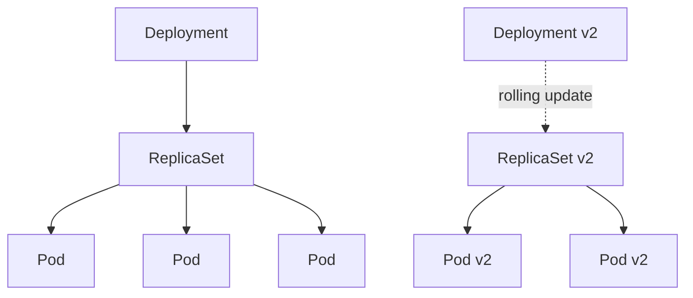
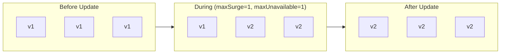
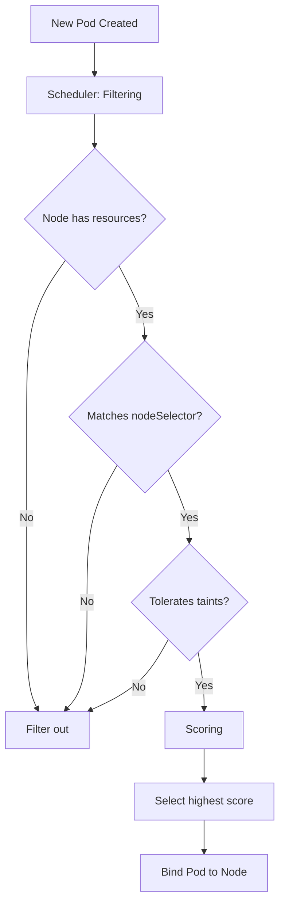
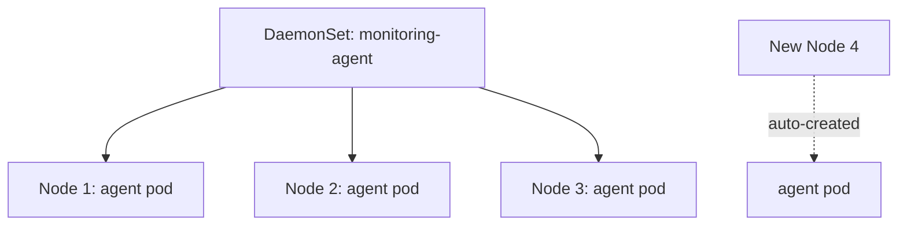

# Workloads & Scheduling (15%)

Managing application deployments and controlling where pods run.

## Competencies

- [ ] Understand application deployments and how to perform rolling update and rollbacks
- [ ] Use ConfigMaps and Secrets to configure applications
- [ ] Configure workload autoscaling
- [ ] Understand the primitives used to create robust, self-healing, application deployments
- [ ] Configure Pod admission and scheduling (limits, node affinity, etc.)

## Section Contents

```
04-workloads-scheduling/
├── README.md
├── pods.md
├── replicasets.md
├── deployments.md
├── daemonsets.md
├── jobs-cronjobs.md
├── configmaps-secrets.md
├── resource-limits.md
├── scheduling/
│   ├── node-selectors.md
│   ├── affinity.md
│   ├── taints-tolerations.md
│   └── static-pods.md
├── autoscaling.md
└── labs/
```

## Workload Resources Hierarchy



## Deployments

### Create Deployment

```yaml
apiVersion: apps/v1
kind: Deployment
metadata:
  name: nginx-deployment
spec:
  replicas: 3
  selector:
    matchLabels:
      app: nginx
  template:
    metadata:
      labels:
        app: nginx
    spec:
      containers:
      - name: nginx
        image: nginx:1.21
        ports:
        - containerPort: 80
```

### Imperative Commands

```bash
# Create
kubectl create deployment nginx --image=nginx --replicas=3

# Scale
kubectl scale deployment nginx --replicas=5

# Update image
kubectl set image deployment/nginx nginx=nginx:1.22

# Rollout status
kubectl rollout status deployment/nginx

# Rollback
kubectl rollout undo deployment/nginx
kubectl rollout undo deployment/nginx --to-revision=2

# History
kubectl rollout history deployment/nginx
```

### Rolling Update Strategy



```yaml
spec:
  strategy:
    type: RollingUpdate
    rollingUpdate:
      maxSurge: 25%        # Max pods above desired during update
      maxUnavailable: 25%  # Max pods unavailable during update
```

## ConfigMaps & Secrets

### ConfigMap

```bash
# Create from literal
kubectl create configmap my-config --from-literal=key1=value1

# Create from file
kubectl create configmap my-config --from-file=config.txt
```

```yaml
# Use as environment variable
env:
- name: MY_VAR
  valueFrom:
    configMapKeyRef:
      name: my-config
      key: key1

# Use as volume
volumes:
- name: config-volume
  configMap:
    name: my-config
```

### Secrets

```bash
# Create secret
kubectl create secret generic my-secret --from-literal=password=mysecret
```

```yaml
# Use as environment variable
env:
- name: PASSWORD
  valueFrom:
    secretKeyRef:
      name: my-secret
      key: password

# Use as volume
volumes:
- name: secret-volume
  secret:
    secretName: my-secret
```

## Resource Management

### Requests & Limits

```yaml
spec:
  containers:
  - name: app
    image: nginx
    resources:
      requests:
        memory: "64Mi"
        cpu: "250m"
      limits:
        memory: "128Mi"
        cpu: "500m"
```

| Type | Purpose |
|------|---------|
| **Requests** | Guaranteed resources, used for scheduling |
| **Limits** | Maximum resources, container killed if exceeded (memory) |

## Scheduling

### Scheduling Decision Flow



### Node Selector

```yaml
spec:
  nodeSelector:
    disktype: ssd
```

### Node Affinity

```yaml
spec:
  affinity:
    nodeAffinity:
      requiredDuringSchedulingIgnoredDuringExecution:
        nodeSelectorTerms:
        - matchExpressions:
          - key: disktype
            operator: In
            values:
            - ssd
```

### Taints & Tolerations

```bash
# Add taint to node
kubectl taint nodes node1 key=value:NoSchedule

# Remove taint
kubectl taint nodes node1 key=value:NoSchedule-
```

```yaml
# Toleration in pod spec
spec:
  tolerations:
  - key: "key"
    operator: "Equal"
    value: "value"
    effect: "NoSchedule"
```

| Effect | Behavior |
|--------|----------|
| `NoSchedule` | Don't schedule new pods |
| `PreferNoSchedule` | Try to avoid scheduling |
| `NoExecute` | Evict existing pods |

### Static Pods

Static pods are managed directly by kubelet, not the API server.

```bash
# Location (check kubelet config)
/etc/kubernetes/manifests/

# Create static pod
cp pod.yaml /etc/kubernetes/manifests/
```

## DaemonSets

Ensures a pod runs on all (or selected) nodes.



```yaml
apiVersion: apps/v1
kind: DaemonSet
metadata:
  name: monitoring-agent
spec:
  selector:
    matchLabels:
      app: monitoring
  template:
    metadata:
      labels:
        app: monitoring
    spec:
      containers:
      - name: agent
        image: monitoring-agent:v1
```

## Practice Scenarios

1. Create a deployment and perform a rolling update
2. Rollback a failed deployment
3. Configure a pod with ConfigMaps and Secrets
4. Schedule a pod on a specific node using affinity
5. Create a DaemonSet for log collection
