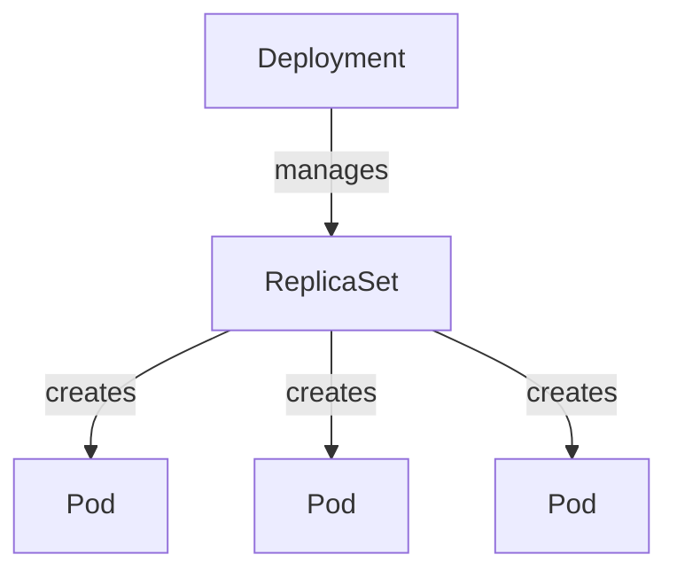
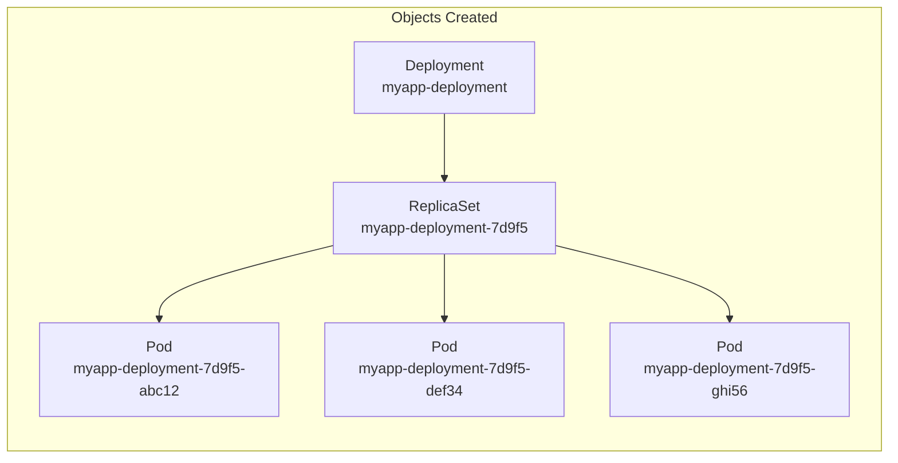
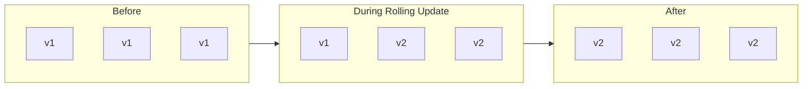

# Deployments

Deployments are the recommended way to manage application workloads in Kubernetes. They provide declarative updates, rollbacks, and scaling capabilities on top of ReplicaSets.

## Why Deployments?

In production, you need more than just running pods:

| Requirement | Solution |
|-------------|----------|
| Run multiple instances | ✓ Deployments manage ReplicaSets |
| Upgrade without downtime | ✓ Rolling updates |
| Undo bad releases | ✓ Rollback capability |
| Batch multiple changes | ✓ Pause and resume |

## Hierarchy



| Object | Responsibility |
|--------|----------------|
| **Deployment** | Rolling updates, rollbacks, versioning |
| **ReplicaSet** | Maintains desired number of pods |
| **Pod** | Runs the actual container(s) |

> 💡 **Key Point:** When you create a Deployment, it automatically creates a ReplicaSet, which in turn creates the Pods.

---

## Deployment Definition

The structure is **identical to ReplicaSet**, only `kind` changes:

```yaml
apiVersion: apps/v1
kind: Deployment
metadata:
  name: myapp-deployment
  labels:
    app: myapp
spec:
  replicas: 3
  selector:
    matchLabels:
      app: myapp
  template:
    metadata:
      labels:
        app: myapp
    spec:
      containers:
      - name: nginx
        image: nginx:1.21
```

### Comparison with ReplicaSet

```yaml
# Only difference is the kind field
kind: ReplicaSet     # For ReplicaSet
kind: Deployment     # For Deployment
```

Everything else (apiVersion, spec, selector, template) remains the same.

---

## What Deployments Create



Notice the naming convention:

- Deployment: `myapp-deployment`
- ReplicaSet: `myapp-deployment-<hash>`
- Pods: `myapp-deployment-<hash>-<random>`

---

## Essential Commands

### Create

```bash
# From file
kubectl create -f deployment.yaml
kubectl apply -f deployment.yaml

# Imperative (quick)
kubectl create deployment nginx --image=nginx --replicas=3
```

### View

```bash
# List deployments
kubectl get deployments
kubectl get deploy          # short form

# See everything created
kubectl get all

# Detailed info
kubectl describe deployment myapp-deployment
```

### Generate YAML Template

```bash
kubectl create deployment nginx --image=nginx --replicas=3 \
  --dry-run=client -o yaml > deployment.yaml
```

---

## Deployment Capabilities

These features make Deployments superior to ReplicaSets:

### 1. Rolling Updates

Upgrade instances one by one, not all at once:



### 2. Rollback

Undo changes if something goes wrong:

```bash
kubectl rollout undo deployment myapp-deployment
```

### 3. Pause & Resume

Batch multiple changes together:

```bash
kubectl rollout pause deployment myapp-deployment
# Make multiple changes...
kubectl rollout resume deployment myapp-deployment
```

> 📝 **Note:** Rolling updates, rollbacks, and strategies are covered in detail in the Deployments advanced section.

---

## Quick Reference

| Command | Description |
|---------|-------------|
| `kubectl create -f deploy.yaml` | Create deployment |
| `kubectl get deploy` | List deployments |
| `kubectl get all` | List all objects |
| `kubectl describe deploy <n>` | Show details |
| `kubectl delete deploy <n>` | Delete deployment |
| `kubectl scale deploy <n> --replicas=N` | Scale deployment |

---

## Key Takeaways

1. **Deployments sit above ReplicaSets** in the hierarchy
2. **YAML is identical to ReplicaSet**, only `kind: Deployment` changes
3. **Automatically creates** ReplicaSet and Pods
4. **Use Deployments** for production workloads, not bare ReplicaSets
5. Provides **rolling updates, rollbacks, pause/resume**
6. Use `kubectl get all` to see the full hierarchy created

---

[Back to 04-workloads-scheduling](README.md)

[Back to root folder](../README.md)
