# ReplicaSets

ReplicaSets ensure a specified number of pod replicas are running at all times. They are the recommended way to manage pod replication in Kubernetes.

## Why ReplicaSets?

### High Availability


Even with a **single pod**, a ReplicaSet ensures automatic recovery if the pod fails.

### Load Balancing & Scaling


ReplicaSets can:

- Span across **multiple nodes**
- Balance load across pods
- Scale up/down based on demand

## ReplicationController vs ReplicaSet

| Aspect | ReplicationController | ReplicaSet |
|--------|----------------------|------------|
| Status | **Deprecated** | **Recommended** |
| apiVersion | `v1` | `apps/v1` |
| Selector | Optional, basic | **Required**, supports `matchLabels` |
| Flexibility | Limited | Advanced matching options |

> 💡 **Always use ReplicaSet** (or Deployments, which manage ReplicaSets).

---

## ReplicaSet Definition

```yaml
apiVersion: apps/v1
kind: ReplicaSet
metadata:
  name: myapp-rs
  labels:
    app: myapp
spec:
  replicas: 3
  selector:
    matchLabels:
      app: myapp
  template:
    metadata:
      labels:
        app: myapp
    spec:
      containers:
      - name: nginx
        image: nginx
```

### Structure Breakdown


### Key Sections

| Section | Purpose |
|---------|---------|
| `replicas` | Desired number of pod instances |
| `selector` | How ReplicaSet finds pods to manage |
| `template` | Pod specification for creating new pods |

---

## Labels and Selectors

### Why Labels Matter

```mermaid
flowchart TB
    RS["ReplicaSet<br/>selector: app=myapp"]
    
    P1["Pod<br/>app: myapp ✓"]
    P2["Pod<br/>app: myapp ✓"]
    P3["Pod<br/>app: other ✗"]
    
    RS -->|monitors| P1
    RS -->|monitors| P2
    RS -.->|ignores| P3
```



The selector tells the ReplicaSet **which pods to manage**. This is crucial because:

- There could be hundreds of pods in the cluster
- ReplicaSet only monitors pods with **matching labels**
- Can manage pods created **before** the ReplicaSet existed

### Selector Matching

```yaml
selector:
  matchLabels:
    app: myapp      # Pod must have label app=myapp
    tier: frontend  # AND label tier=frontend
```

> ⚠️ **Important:** Labels in `selector.matchLabels` must match labels in `template.metadata.labels`.

---

## Why Template is Always Required

Even if pods already exist, the template section is required.

**Scenario:**

1. 3 pods with `app: myapp` already running
2. Create ReplicaSet with `replicas: 3` and `selector: app: myapp`
3. ReplicaSet adopts existing pods, creates nothing new

**But what happens when a pod fails?**

The ReplicaSet needs the template to create a replacement pod.

```mermaid
flowchart LR
    P1["Pod 1 ✓"]
    P2["Pod 2 💀"]
    P3["Pod 3 ✓"]
    
    RS["ReplicaSet"]
    TEMP["Template"]
    
    P2 -->|fails| RS
    RS -->|uses| TEMP
    TEMP -->|creates| P4["Pod 2 (new) ✓"]
```



---

## Essential Commands

### Create

```bash
kubectl create -f replicaset.yaml
kubectl apply -f replicaset.yaml
```

### View

```bash
# List ReplicaSets
kubectl get replicaset
kubectl get rs              # short form

# Detailed info
kubectl describe rs myapp-rs

# View pods created by ReplicaSet
kubectl get pods
# Pods will be named: myapp-rs-xxxxx
```

### Scale

```bash
# Method 1: Edit file and replace
# Edit replicaset.yaml, change replicas to 6
kubectl replace -f replicaset.yaml

# Method 2: Scale command (doesn't update file)
kubectl scale --replicas=6 -f replicaset.yaml

# Method 3: Scale by name
kubectl scale --replicas=6 replicaset myapp-rs
```

> ⚠️ **Note:** `kubectl scale` does NOT update the YAML file. The file will still show the old replica count.

### Delete

```bash
kubectl delete replicaset myapp-rs
# This also deletes all pods managed by the ReplicaSet
```

---

## Common Errors

### Wrong apiVersion

```yaml
# ✗ WRONG
apiVersion: v1
kind: ReplicaSet

# Error: no matches for kind "ReplicaSet" in version "v1"

# ✓ CORRECT
apiVersion: apps/v1
kind: ReplicaSet
```

### Selector Doesn't Match Template Labels

```yaml
# ✗ WRONG - labels don't match
selector:
  matchLabels:
    app: myapp
template:
  metadata:
    labels:
      app: different    # Must be "myapp"

# ✓ CORRECT
selector:
  matchLabels:
    app: myapp
template:
  metadata:
    labels:
      app: myapp        # Matches selector
```

---

## Quick Reference

| Command | Description |
|---------|-------------|
| `kubectl create -f rs.yaml` | Create ReplicaSet |
| `kubectl get rs` | List ReplicaSets |
| `kubectl describe rs <name>` | Show details |
| `kubectl scale --replicas=N rs <name>` | Scale ReplicaSet |
| `kubectl delete rs <name>` | Delete ReplicaSet + pods |
| `kubectl replace -f rs.yaml` | Update from file |

---

## Key Takeaways

1. **ReplicaSets ensure high availability** - automatic pod recovery
2. **Use `apps/v1`** apiVersion, not `v1`
3. **Selector is required** and must match template labels
4. **Template is always required** for creating replacement pods
5. **Labels connect everything** - selector finds pods by labels
6. **`kubectl scale` doesn't update the file** - be aware of drift
7. In practice, use **Deployments** which manage ReplicaSets for you

---

[Back to 04-workloads-scheduling](README.md)

[Back to root folder](../README.md)
