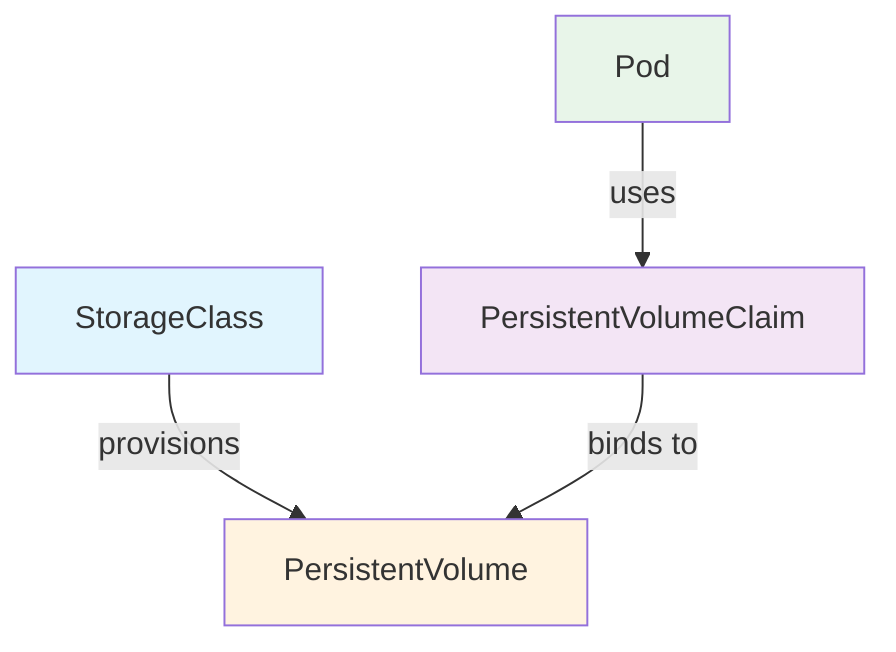
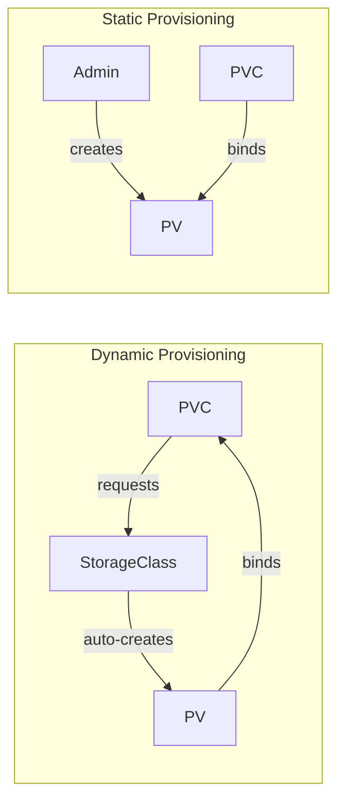
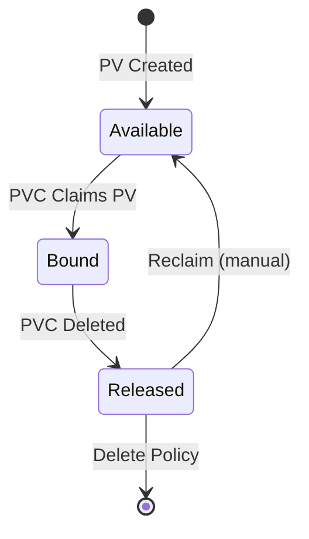

# Storage (10%)

Managing persistent data in Kubernetes.

## Competencies

- [ ] Implement storage classes and dynamic volume provisioning
- [ ] Configure volume types, access modes and reclaim policies
- [ ] Manage persistent volumes and persistent volume claims

## Section Contents

```
05-storage/
├── README.md
├── volumes.md
├── persistent-volumes.md
├── persistent-volume-claims.md
├── storage-classes.md
└── labs/
```

## Storage Concepts



## Volume Types

| Type | Use Case |
|------|----------|
| `emptyDir` | Temporary storage, deleted with pod |
| `hostPath` | Mount host directory (testing only) |
| `persistentVolumeClaim` | Persistent storage |
| `configMap` | Configuration files |
| `secret` | Sensitive data |

### emptyDir

```yaml
spec:
  containers:
  - name: app
    volumeMounts:
    - name: cache
      mountPath: /cache
  volumes:
  - name: cache
    emptyDir: {}
```

### hostPath

```yaml
spec:
  volumes:
  - name: data
    hostPath:
      path: /data
      type: DirectoryOrCreate
```

## Persistent Volumes (PV)

```yaml
apiVersion: v1
kind: PersistentVolume
metadata:
  name: my-pv
spec:
  capacity:
    storage: 10Gi
  accessModes:
    - ReadWriteOnce
  persistentVolumeReclaimPolicy: Retain
  storageClassName: manual
  hostPath:
    path: /mnt/data
```

### Access Modes

| Mode | Abbreviation | Description |
|------|--------------|-------------|
| ReadWriteOnce | RWO | Single node read-write |
| ReadOnlyMany | ROX | Multiple nodes read-only |
| ReadWriteMany | RWX | Multiple nodes read-write |

### Reclaim Policies

| Policy | Behavior |
|--------|----------|
| `Retain` | Keep data, manual cleanup required |
| `Delete` | Delete storage when PVC deleted |
| `Recycle` | Basic scrub (deprecated) |

## Persistent Volume Claims (PVC)

```yaml
apiVersion: v1
kind: PersistentVolumeClaim
metadata:
  name: my-pvc
spec:
  accessModes:
    - ReadWriteOnce
  resources:
    requests:
      storage: 5Gi
  storageClassName: manual
```

### Using PVC in Pod

```yaml
spec:
  containers:
  - name: app
    volumeMounts:
    - name: storage
      mountPath: /data
  volumes:
  - name: storage
    persistentVolumeClaim:
      claimName: my-pvc
```

## Storage Classes

Enable dynamic provisioning of PVs.



```yaml
apiVersion: storage.k8s.io/v1
kind: StorageClass
metadata:
  name: fast
provisioner: kubernetes.io/aws-ebs
parameters:
  type: gp2
reclaimPolicy: Delete
volumeBindingMode: WaitForFirstConsumer
```

### Volume Binding Modes

| Mode | Behavior |
|------|----------|
| `Immediate` | Bind PV as soon as PVC is created |
| `WaitForFirstConsumer` | Wait until pod using PVC is scheduled |

### Dynamic Provisioning

```yaml
# PVC with StorageClass (no PV needed)
apiVersion: v1
kind: PersistentVolumeClaim
metadata:
  name: dynamic-pvc
spec:
  accessModes:
    - ReadWriteOnce
  resources:
    requests:
      storage: 10Gi
  storageClassName: fast    # References StorageClass
```

## PV/PVC Lifecycle



## Common Commands

```bash
# List PVs and PVCs
kubectl get pv
kubectl get pvc

# Describe for troubleshooting
kubectl describe pv my-pv
kubectl describe pvc my-pvc

# Check storage classes
kubectl get storageclass
```

## Troubleshooting

### PVC Stuck in Pending

```bash
kubectl describe pvc my-pvc
```

Common causes:
- No matching PV (capacity, access mode, storage class)
- StorageClass doesn't exist
- Dynamic provisioning failed

### PV Stuck in Released

After PVC deletion with `Retain` policy:
```bash
# Edit PV to remove claimRef
kubectl edit pv my-pv
# Delete the claimRef section
```

## Practice Scenarios

1. Create a PV and PVC, mount in a pod
2. Configure dynamic provisioning with a StorageClass
3. Expand a PVC (if storage class allows)
4. Troubleshoot a PVC stuck in Pending state
5. Change reclaim policy on an existing PV
