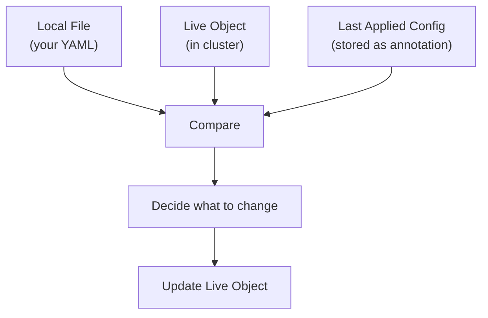
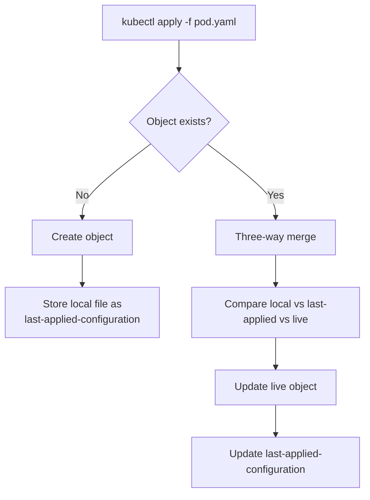

# Imperative vs Declarative

Understanding these two approaches is essential for both managing Kubernetes clusters and succeeding in the CKA exam.

## The Concept


| Approach | Description | Analogy |
|----------|-------------|---------|
| **Imperative** | Step-by-step instructions on HOW to do something | "Turn right, then left, then right again" |
| **Declarative** | Declare WHAT you want, system figures out how | "Take me to Tom's house" |

---

## Imperative Approach

### Method 1: Commands (No YAML)

Quick, one-time tasks. Good for exam speed.

```bash
# Create
kubectl run nginx --image=nginx
kubectl create deployment nginx --image=nginx
kubectl expose pod nginx --port=80

# Update
kubectl edit deployment nginx
kubectl scale deployment nginx --replicas=5
kubectl set image deployment/nginx nginx=nginx:1.19

# Delete
kubectl delete pod nginx
```

**Pros:**

- Fast for simple tasks
- No YAML files needed
- Great for CKA exam

**Cons:**

- Limited functionality
- No record of what was done
- Hard to track changes
- Complex commands for advanced use cases

### Method 2: Commands + YAML Files

```bash
# Create
kubectl create -f pod.yaml

# Update
kubectl replace -f pod.yaml
kubectl replace --force -f pod.yaml    # Delete and recreate

# Delete
kubectl delete -f pod.yaml
```

**Pros:**

- Changes are documented in files
- Can be version controlled (git)
- Supports complex configurations

**Cons:**

- `create` fails if object exists
- `replace` fails if object doesn't exist
- Must track object state manually

---

## Declarative Approach

Use `kubectl apply` for everything:

```bash
# Create, Update, or manage - same command
kubectl apply -f pod.yaml
kubectl apply -f /path/to/config-files/
```


**Pros:**
- Single command for all operations
- 
- Intelligent - creates if not exists, updates if exists
- Never fails because object exists/doesn't exist
- Ideal for production and GitOps

**Cons:**

- Slightly slower than imperative for simple tasks

---

## When to Use What

| Scenario | Recommended Approach |
|----------|---------------------|
| CKA Exam - quick tasks | Imperative commands |
| CKA Exam - complex objects | Declarative with `apply` |
| Production environment | Declarative |
| One-time debugging | Imperative |
| GitOps / CI/CD | Declarative |

---

## CKA Exam Tips 🎯

### Generate YAML Templates

Use `--dry-run=client -o yaml` to generate YAML without creating the resource:

```bash
# Generate and save to file
kubectl run nginx --image=nginx --dry-run=client -o yaml > pod.yaml

# Then edit and apply
vim pod.yaml
kubectl apply -f pod.yaml
```

### Pod

```bash
# Create pod
kubectl run nginx --image=nginx

# Generate YAML
kubectl run nginx --image=nginx --dry-run=client -o yaml

# Pod with labels
kubectl run nginx --image=nginx --labels="app=web,tier=frontend"

# Pod with port
kubectl run nginx --image=nginx --port=80
```

### Deployment

```bash
# Create deployment
kubectl create deployment nginx --image=nginx

# Generate YAML
kubectl create deployment nginx --image=nginx --dry-run=client -o yaml

# With replicas
kubectl create deployment nginx --image=nginx --replicas=4

# Save to file, edit, then apply
kubectl create deployment nginx --image=nginx --dry-run=client -o yaml > deploy.yaml
```

### Service

```bash
# Expose pod as ClusterIP (uses pod's labels as selector)
kubectl expose pod redis --port=6379 --name=redis-service

# Expose pod as NodePort
kubectl expose pod nginx --type=NodePort --port=80 --name=nginx-service

# Generate YAML
kubectl expose pod nginx --port=80 --dry-run=client -o yaml

# Create service directly (doesn't use pod labels - less useful)
kubectl create service clusterip redis --tcp=6379:6379
kubectl create service nodeport nginx --tcp=80:80 --node-port=30080
```

> ⚠️ **Note:** `kubectl expose` uses pod labels as selectors automatically. `kubectl create service` does not—it assumes `app=<name>`. Prefer `expose` when possible.

### ConfigMap & Secret

```bash
# ConfigMap from literal
kubectl create configmap app-config --from-literal=key1=value1

# ConfigMap from file
kubectl create configmap app-config --from-file=app.properties

# Secret
kubectl create secret generic app-secret --from-literal=password=mysecret
```

### ServiceAccount

```bash
kubectl create serviceaccount dashboard-sa
```

### Namespace

```bash
kubectl create namespace dev
```

---

## kubectl explain

Explore resources without leaving the terminal:

### List All Resources

```bash
kubectl api-resources
```

Shows:

- Resource names and short names
- API version (v1, apps/v1, etc.)
- Whether it's namespaced
- Kind (for YAML files)

### Explain a Resource

```bash
# Top-level fields
kubectl explain pod

# Specific field
kubectl explain pod.spec

# Go deeper
kubectl explain pod.spec.containers

# Full recursive output (all fields)
kubectl explain pod --recursive

# Specific field with full path
kubectl explain pod.spec.containers.resources
```

### Example Output

```bash
$ kubectl explain pod.spec.containers.resources
KIND:     Pod
VERSION:  v1

RESOURCE: resources <Object>

DESCRIPTION:
     Compute Resources required by this container.

FIELDS:
   limits       <map[string]string>
   requests     <map[string]string>
```

> 💡 **Exam Tip:** Use `kubectl explain` when you can't remember the exact field name or structure. It's faster than searching documentation.

---

## Quick Reference

### Key Flags

| Flag | Purpose |
|------|---------|
| `--dry-run=client` | Test command without creating resource |
| `-o yaml` | Output as YAML |
| `-o json` | Output as JSON |
| `-o wide` | Show additional info |
| `--recursive` | Show all nested fields (with explain) |

### Common Patterns

```bash
# Generate YAML template
kubectl <command> --dry-run=client -o yaml > file.yaml

# Edit and apply
vim file.yaml
kubectl apply -f file.yaml

# Quick edit existing resource
kubectl edit <resource> <name>

# View resource definition
kubectl get <resource> <name> -o yaml
```

---

## Key Takeaways

1. **Imperative** = HOW to do it (step by step)
2. **Declarative** = WHAT you want (system figures it out)
3. **CKA Exam:** Use imperative for speed, declarative for complex objects
4. **`--dry-run=client -o yaml`** is your best friend for generating templates
5. **`kubectl apply`** is intelligent—creates or updates as needed
6. **`kubectl explain`** helps you explore resource fields without docs
7. **`kubectl expose`** is better than `kubectl create service` (uses pod labels)
8. **Don't mix approaches**—if using `apply`, stick with it

---

## Deep Dive: How kubectl apply Works

Understanding this helps you debug unexpected behavior.

### Three-Way Merge

When you run `kubectl apply`, Kubernetes compares **three sources**:



| Source | Location | Purpose |
|--------|----------|---------|
| **Local file** | Your filesystem | What you want now |
| **Live object** | Kubernetes cluster memory | Current state |
| **Last applied config** | Annotation on live object | What you wanted last time |

### Why Three Sources?

The "last applied configuration" helps detect **deleted fields**.

**Example - Deleting a label:**

```yaml
# Original local file (first apply)
metadata:
  labels:
    app: myapp
    type: frontend    # This label exists

# Updated local file (second apply)
metadata:
  labels:
    app: myapp
    # type: frontend  # Label removed!
```

**How Kubernetes decides:**

| Field | Local File | Last Applied | Live Object | Action |
|-------|------------|--------------|-------------|--------|
| `app: myapp` | ✓ | ✓ | ✓ | Keep |
| `type: frontend` | ✗ | ✓ | ✓ | **Delete** (was in last applied, now removed) |
| `other: value` | ✗ | ✗ | ✓ | Keep (not managed by apply) |

> 💡 If a field exists in live object but was **never** in last applied config, `apply` leaves it alone. This allows other tools/controllers to add fields without `apply` removing them.

### Where is Last Applied Config Stored?

As an annotation on the live object itself:

```yaml
metadata:
  annotations:
    kubectl.kubernetes.io/last-applied-configuration: |
      {"apiVersion":"v1","kind":"Pod","metadata":{"name":"nginx",...}
```

View it with:

```bash
kubectl get pod nginx -o yaml | grep -A5 "last-applied"
```

### Important Warning

> ⚠️ **Don't mix imperative and declarative approaches!**

`kubectl create` and `kubectl replace` do **NOT** store the last applied configuration.

If you:

1. Create with `kubectl create -f pod.yaml`
2. Later update with `kubectl apply -f pod.yaml`

The three-way merge won't work correctly because there's no "last applied" to compare against.

**Best practice:** Pick one approach and stick with it.

| Approach | Commands to Use |
|----------|-----------------|
| Imperative | `create`, `replace`, `delete`, `edit` |
| Declarative | `apply` for everything |

### Apply Workflow Summary


